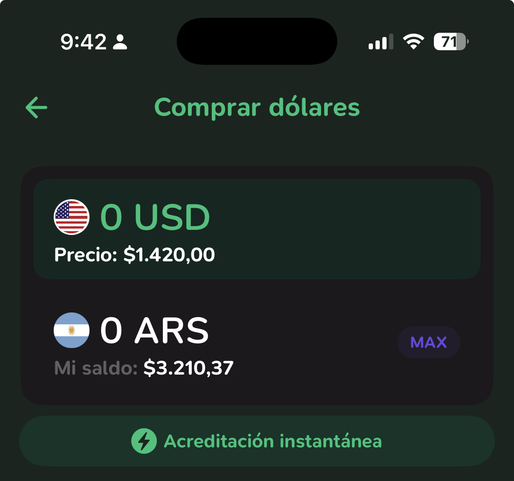

# Análisis Funcional — omero-finance

> Documento vivo. Actualizarlo a medida que se corrigen issues o cambia la lógica.
>
> Estado: `[ ]` pendiente · `[~]` en progreso · `[x]` resuelto

---

## 1. Ingresos (`/api/income`)

### Lógica de registro

- **ARS:** `amount` y `amountArs` se guardan con el mismo valor.
- **USD:** Cuando se suman dolares, estos deben persistir como dolares no como ARS, debería poder persistir el amountArsSnapshot ya que es el valor en pesos de ese momento, esto nos serviría como calculo de cuanto podría haber generado de diferencia, pero no son pesos ya que no existen. Ahora para el calculo de ese snapshot, se busca el tipo de cambio más reciente en DB → `amountArsSnapshot = amount × dollarRateSnapshot`. Si no hay tasa en DB, podríamos buscar el valor en la API de los dolares y traer ese valor, y setearlo en la DB y además calcularlo, en caso contrario, simplemente amountArsSnapshot queda null.

### Tipos disponibles

`SUELDO` · `FREELANCE` · `AHORROS` · `PAGO_DEUDA` · `REMANENTES` · `PRESTAMO` · `INVERSION`

Que está lista tenga un CRUD, y se puedan setear nuevos valores, y poder eliminar, esto también deberían tener una pantalla

El campo `isPersonal` separa si el ingreso pertenece al hogar o a un usuario específico.
~~`targetUserId` permite registrar un ingreso a nombre de otro miembro del hogar.~~ Los ingresos los carga cada persona por separado, y es quien se encarga de registrar cada uno.

### Issues

| # | Estado | Descripción |
|---|---|---|
| I-1 | `[ ]` | Ingreso USD sin tasa en DB → `amountArs` queda `undefined`. Ese ingreso no suma al balance ni al dashboard. |

Debe existir amountUSD y amountARS para que podamos tener en persistencia ambos datos, pero también tener un CTA que me permita decir llevar de dolares a pesos o viceversa de pesos a dolares esto debe quedar:

Ingreso: amountArs: -1000 amountUsd: 1 (esto suma dolares y resta los pesos, lo que daría un cambio de pesos a dolares)

Ingreso: amountArs: 1000 amountUsd: -1 (esto suma pesos y resta los dolares, lo que sería un cambio de dolares a pesos )

Esto me lo debe permitir en algún lado la app para yo poder mapear lo que dolarizamos y lo que no, y además, debemos persistir la información de eso, ¿lo haríamos en la tabla de ingresos? me parece que si pero dame alguna idea.

Ahora para está acción se de, yo debo agregar el precio del cambio, es decir, desde cuando doy al CTA me debe abrir un modal con los inputs de pesos y dolares:


Además que me permita modificar si de pesos a dolares o de dolares a pesos y aparte otro input que me permita poner el precio del tipo de cambio, pero por defecto carguemos el ultimo, además de un btn que me permita agregar el máximo.

---

## 2. Balance disponible (`/api/balance`)

### Fórmula

Está formula está erronea:
```
fondoUsd  = Σ ingresos USD donde amountArs IS NULL  (sin convertir)
incomeArs = Σ ingresos ARS + Σ ingresos USD donde amountArs IS NOT NULL

totalExpenses = fixedExpenses.amountArs
              + groceryExpenses.amountArs
              + householdExpenses.amountArs
              + personalExpenses.amountArs
              + tdcPagadas.amountToPay   (solo isPaid = true)
              → cada línea usa amountArs ?? amount como fallback

usdEquivalentArs = fondoUsd × rateHoy   (tasa más reciente en DB)

totalArs = incomeArs + usdEquivalentArs − totalExpenses
```

La formula correcta:
```
incomeUsd = Σ ingresos USD (amountUsd)
incomeArs = Σ ingresos ARS (amountArs)

totalComprometidoArs = fixedExpenses.amountArs
              + groceryExpenses.amountArs
              + householdExpenses.amountArs
              + personalExpenses.amountArs
              + tdcPagadas.amountToPay
              → cada línea debe contemplar solo lo que no está pago (isPaid=false)
              → cada línea usa amountArs ?? amount como fallback

totalComprometidoUSD = tdcPagadas.amountToPayUsd   (solo isPaid = false)

totalExpensesArs = fixedExpenses.amountArs
              + groceryExpenses.amountArs
              + householdExpenses.amountArs
              + personalExpenses.amountArs
              + tdcPagadas.amountToPay   
              → cada línea debe contemplar solo lo que está pago (solo isPaid = true)
              → cada línea usa amountArs ?? amount como fallback

totalExpensesUSD = + tdcPagadas.amountToPayUsd   (solo isPaid = true)

totalArs = incomeArs − totalExpenses
totalUsd = incomeUsd - totalExpensesUSD
```

### Lo que devuelve

Tabla que debemos reevaluar
| Campo | Qué es |
|---|---|
| `totalArs` | Disponible neto en ARS (incluye USD × tasa hoy) |
| `fondoUsd` | Dólares acumulados sin convertir (informativo) |
| `usdEquivalentArs` | fondoUsd × rateHoy |
| `rateHoy` | Tipo de cambio del día |
| `comprometidoArs` | Suma de todos los gastos del mes |

Tabla que debemos evaluar para traer
| Campo | Qué es |
|---|---|
| `totalArs` | Disponible neto en ARS |
| `totalUsd` | Disponible neto en USD |
| `rateHoy` | Tipo de cambio del día |
| `comprometidoArs` | Suma de todos los gastos del mes en pesos sin pagar |
| `comprometidoUSD` | Suma de todos los gastos del mes en dolares sin pagar |
| `totalExpensesArs` | Suma de todos los gastos del mes en pesos que ya se pagaron |
| `totalExpensesUSD` | Suma de todos los gastos del mes en dolares que ya se pagaron |

### Módulos que NO descuenta el balance

Ahorros, alquileres y préstamos son módulos independientes. No se restan del disponible automáticamente.

Los modulos de ahorros, alquileres y prestamos no afectan directamente al balance mensual, pero si al patrimonio, por eso debemos generar un modulo de patrimonio, en donde podamos calcular todo esto.

Los ahorros son parte de esté patrimonio.
Los prestamos también son parte de los gastos del patrimonio

Entonces en teoria debería ser el calculo del patrimonio:

activos - expense = PN

Entonces, en alquileres es un modulo que debe afectar al apartado de los gastos fijos, en donde yo puedo ir cargando cuanto pago de alquiler, y cuanto tengo de deudas de expensas y demás, esto para entender como está el alquiler mes con mes y ver si tuvimos algún aumento o algo, esto debe permitirme decir que ya pague el alquiler, y entneder cuantos meses me quedan, cuanto puede llegar hacer el aumento y demás, entonces es una forma de visualizar lo del alquiler, pero indirectamente debería afectar en mis gastos fijos, solo que en alquiler debo seleccionar que ya lo pague y eso agregarlo como un gasto que se corrio y debe impactar en el balance igualmente, o si lo cargo por el formulario es lo mismo.

Prestamos, si yo ingreso un prestamo eso me debería entrar en los ingresos como dinero que entro pero también en los pasivos que debo, entonces yo tengo que poder tener también un apartado de pasivos para entender la deuda completa de mi patrimonio. Entonces cuando yo vaya a prestamos tener la oportunidad de cargar las TNA, LA TEA y todos los datos que vos necesites para aplicar y hasta incluso la cuotas mes a mes, si es posible, y cuando me la cobran y todo, para que seas un proceso automatico y me avises cuando tengo que pagar, e incluso poder avisar de algún adelanto que esto debe afectar el balance claramente, además cuando agrego un prestamo en mis gastos fijos debo poder afectarlos y que se agregue ese prestamo como deuda fija mensual, y ya de una vez calcule lo que debo ir pagando mes a mes.

Ahorros, esto debe ir sumandose al patrimonio, y también debe tener un apartado de uso para que cuando se usen esos ahorros poder marcarlos baja de ahorros pero que no necesariamente sea un gasto general, ya que capaz no se resto del balance general.

Dbeemos crear entonces dos nuevos modulos:

Patrimonio
Pasivos
Inversiones
Fondo de emergencia

Donde en pasivo, podemos solicitar de alguna forma, los gastos corrientes de tarjeta de crédito (podemos sumarlo en un apartado, donde carguemos el total de la tdc, por más que no la vayamos a pagar) y el total de prestamos y demás.
Patrimonio las deudas que tienen conmigo, los ahorros y las inversiones 
Inversiones sería un apartado que por ejemplo de cuanto inverti en Abril (principio) y cuanto hay el final de abril, y cuanto inverti ahora y cuanto tengo a final de mayo y así ir viendo cuanto ha crecido de manera pasiva mi patrimonio y mis inversiones, y así conocer eso. También poder agregar un resumen de lo que se invirtió, cuanto queda, cuanto se quedo, cuanto es en pesos y si tengo inversiones también hacerlo en relación a los dolares ambos caminos, poder seleccionar el activo que usamos para invertir, pueden ser acciones, bonos y hasta inclusive criptomonedas todo eso para tenerlo bien defnido.
Fondo de emergencias ver cuanto tenemos de fondo de emergencia, y calcularlo mes a mes ya que los tengo en dolares y generan un 3.8% casi anuales, así que es ir diciendo cuanto tenemos de eso e ir incrementando nuestro fondo de emergencia.


### Issues

| # | Estado | Descripción |
|---|---|---|
| B-1 | `[ x]` | Ahorros y alquiler no se descuentan del balance. El disponible puede parecer mayor de lo real. Evaluar si debe incluirlos o dejarlos como módulos separados. |

---

## 3. Dashboard mensual (`/lib/dashboard.ts`)

### 3a. Total de ingresos del mes

```
totalIncomeArs = Σ income del mes usando (amountArs ?? amount)
totalIncomeUsd = Σ income del mes usando (amountArs ?? amount) (esté menos relevante pero que aparezca)
```

Incluye todos los tipos de ingreso (SUELDO, FREELANCE, etc.).

### 3b. Split por usuario (proporciones)

```
incomeByUser[userId] = Σ ingresos tipo SUELDO del usuario
sueldoTotal          = Σ todos los SUELDO del hogar (acá se debe sumar todos los sueldos, tanto en dolares como en pesos, si está en dolares se debe calcular con el precio del tipo de cambio del momento)

Esto debe guardarse y persistirse pero se debe hacer desde algún momento, es decir que siempre vaya variando, hasta el momento en que se diga cierre de ingresos esto debe ser un nuevo CTA que permita cerrar los sueldos y ya definir el porcentaje de uso, ya que pueden haber ingresos de sueldo a mitad de mes que no deben afectar nada el calculo inicial.
user.percentage = incomeByUser[userId] / sueldoTotal
```

Solo el `SUELDO` define la proporción de responsabilidad. Freelance, inversiones, etc. suman al total pero no cambian el porcentaje por categoría.

### 3c. Montos presupuestados por categoría

**Categorías auto** — calculadas desde la DB, no editables como porcentaje:

| Categoría | Fórmula `budgeted` |
|---|---|
| `TDC` | `Σ tdcEffective(c)` de todos los statements del mes |
| `GASTOS_FIJOS` | `Σ amount` de templates activos en ARS |

```
tdcEffective(c):
  si payMinimum=true  y minimumPayment > 0  → minimumPayment
  si payMinimum=false y committedOverride != null → committedOverride
  sino → amountToPay + (usdAmount × exchangeRate)
```

Acá donde debemos analizar un poco:

La idea es que vos puedas, seleccionar el monto que desees pagar, entonces tenemos varios casos de uso:

1) se paga el pago minimo y ya.
2) se paga el pago minimo + monto en usd
3) se paga el monto total y ya
4) se paga el monto total + monto en usd
5) se paga otro monto > pago minimo y ya
6) se paga otro monto > pago mínimo + monto en usd
7) se paga otro monto < pago mínimo + monto en usd
8) se paga otro monto < pago mínimo y ya

Entonces la idea es que para armar el presupuesto solo se contemple los casos del 1 al 6, que sería lo ideal para no quedar en vencido. Esto debe ser posible desde el modulo de TDC que hoy es muy rigido.

**Categorías configurables** — override manual por porcentaje o monto fijo:

```
calculateCategoryAmount(totalIncomeArs, config, autoAmount):
  si manualAmount > 0      → manualAmount
  si manualPercentage > 0  → totalIncomeArs × manualPercentage
  sino                     → autoAmount (0 para estas categorías)
```

| Categoría | `isReserved` default | Configurable |
|---|---|---|
| `MERCADO` | true | % o ARS manual |
| `GASTOS_LIBRES` | true | remanente auto (ver 3d) |
| `AHORRO_CASA` | false | % o ARS manual |
| `AHORRO_VACACIONES` | false | % o ARS manual |
| `INVERSION_AHORRO` | false | % o ARS manual |
| `OTROS` | true | % o ARS manual |

Debemos poder en algún lado de difinición del presupuesto tener la posibilidoad de decir si es % o ars
Las categorias configurables, deberían tener la forma de cambiarles el nombre, y/o agregar nuevas, si en meses anteriores no existían ciertas categorias deberían ser tomadas como 0 los valores presupuestados allí. 

### 3d. GASTOS\_LIBRES — el remanente automático

```
reservedAmounts = budgeted de todas las categorías con isReserved=true (excepto GASTOS_LIBRES)

gastosLibres =
  si hay manualConfig → calculateCategoryAmount (% o ARS manual)
  sino               → max(0, totalIncomeArs − Σ reservedAmounts)
```

Nunca es negativo. Si el total comprometido supera los ingresos, muestra 0.

### 3e. Montos "usados" (gasto real del mes)

| Categoría | Fuente de datos |
|---|---|
| `TDC` | `Σ tdcEffective(c)` donde `isPaid = true` |
| `GASTOS_FIJOS` | `Σ FixedExpense.amount` del mes (registros reales) |
| `MERCADO` | `Σ GroceryExpense.amount` del mes |
| `GASTOS_LIBRES` | `Σ HouseholdExpense.amount` del mes |
| `AHORRO_CASA` | `Σ Saving.amount` donde `type = AHORRO` (ARS, ese mes) |
| `AHORRO_VACACIONES` | `Σ Saving.amount` donde `type = VIAJE` (ARS, ese mes) |
| `INVERSION_AHORRO` | `Σ Saving.amount` donde `type = INVERSION` (ARS, ese mes) |
| `OTROS` | `Σ PersonalExpense.amount` del mes (todos los usuarios) |

Acá es donde debe figurar la parte de gastos en ARS y en USD para que podamos definir cuanto se gasto y cuanto afecto a cada fondo, y eso debe poderse agregar en cada sección donde yo defino un gasto poder definir si se marca como dolares o pesos, más que nada en las tdc que tienen ese comportamiento y en los savings que también es posible hacer eso. Igual debe verse afectado por el comentario de otros puntos atrás.

Las tdc deben guardar un registro de cada pago, porque hoy se guarda solo 1, y debe guardarse los varios pagos que se pueden hacer, ya que en el mes pueden aparecer varios.

### 3f. Available y desglose por usuario

El disponible por usuario debe verse reflejado con respecto a gastos libres, que es el budget principal de gastos porque el resto se caclula en base a los gastos mensuales, y lo libre queda allí + los ingresos que tenga cada usuario por separado que eso también entra en su saldo disponible.

El disponible por hogar es todo lo que hoy tiene es decir - los gastos libres que ya representan una salida + los gastos que no se hicieron aún - (inversiones + ahorros y demas ) ese sería el disponible del hogar.

```
availableArs = budgetedArs − usedArs   (puede ser negativo → isOverspent = true)

perUserBudget[userId] = budgetedArs × (user.incomeArs / totalIncome)

perUser[userId] = {
  budgeted:  perUserBudget[userId],
  used:      usedArs × user.percentage,   ← estimación proporcional, no el gasto real
  available: budgeted − used
}
```

### 3g. Superávit

```
surplusArs = totalIncomeArs − Σ budgetedArs de categorías con isReserved=true
```

No incluye categorías con `isReserved=false` (ahorros, inversión).

### Issues

| # | Estado | Descripción |
|---|---|---|
| D-1 | `[ ]` | `GASTOS_FIJOS` tiene dualidad: **budgeted** viene de templates, **used** de registros reales. Si se carga el template pero nunca se registra el gasto real en `FixedExpense`, el available aparece como disponible aunque el dinero ya salió. Evaluar si el `used` de GASTOS_FIJOS debería venir también del template (marcar como pagado) o si el flujo de registro debe ser más claro en la UI. |
| D-2 | `[ ]` | `perUser.used` es proporcional al sueldo, no el gasto real por persona. Si Maria gasta todo el mercado, Avelino igual aparece con el 50% usado. |
| D-3 | `[ ]` | Ahorros en USD no entran al `usedAmounts` (el query filtra `currency: "ARS"`). Un ahorro en dólares no aparece en el dashboard. |

D1: Debe poder tener un btn que me permita decir que lo use desde gasto fijos que eso indirectamente haga un gasto y registre eso para que el balance sea afectado, y si es posible que en la UI mostremos aún sin pagar, o pendiente de pagar o algo para que sea pensado que se tiene que hacer es buenisima idea.
D2: Los gastos del mercado y de todo no es proporcional, ya que el gasto libre es lo unico que debe verse afeectado, es solo visual entender cuanto pone cada uno para el mercado, ya que manejamos una misma cuenta para todo los gastos comunes.
D3: Debería aparecer ya lo hice mención arriba.

---

## 4. TDC — tarjetas de crédito (`/api/tdc`)

### Modos de pago al crear

El statement se crea con `amountToPay = totalAmountArs` como valor inicial.

### Modos de pago al actualizar (PATCH)

| Escenario | Resultado en DB |
|---|---|
| `customAmount` enviado | `amountToPay = customAmount`, `payMinimum = true` |
| `totalAmountArs` enviado | `amountToPay = totalAmountArs` |
| `committedOverride` enviado | campo separado, no modifica `amountToPay` |
| `payMinimum: true/false` enviado | solo actualiza el flag |


Más arriba te agregue los 8 caso de usos que pueden pasar con respecto a esto, todo debe ser registrado como amountToPay en usd y amountToPay en ars para separar y poder tener el control de eso.

### Prioridad en tdcEffective (usado en dashboard)

```
1. payMinimum=true  → minimumPayment
2. payMinimum=false y committedOverride != null → committedOverride
3. sino → amountToPay + (usdAmount × exchangeRate)
```

Esto está ok solo que debemos agregar los otros casos de uso, define ahora el orden que debe tener con esos nuevos casos de usos a ver si tenemos algo para evaluar.


### Pago con débito de cuenta

Si el PATCH incluye `accountId` y `deductAmount`:
```
transaction:
  1. update CreditCardStatement (isPaid=true, paidAt=now)
  2. account.balance -= deductAmount
```

No entendí esto, ¿que significa y como lo veo?


### Alertas TDC

```
alerta si: !isPaid && dueDate ≤ now + 7 días
daysUntilDue = ceil((dueDate − now) / 86_400_000)
ordenadas por daysUntilDue ASC
```

Se podría hacer algún tipo de flujo para que me avises por un mensaje o algo que yo pueda enterarme? pensemos en una lógica para lograr algo así.

### Issues

| # | Estado | Descripción |
|---|---|---|
| T-1 | `[ ]` | Al setear `customAmount`, el PATCH también fuerza `payMinimum: true`. Esto hace que `tdcEffective()` en el dashboard use `minimumPayment` en lugar del custom. Los dos campos se pisan. Probablemente `payMinimum` debería quedar en `false` cuando hay un `customAmount`. |
| T-2 | `[ ]` | La spec dice que las alertas son para `dueDate ≤ 3 días`. El código usa 7 días. Definir cuál es el correcto y unificarlo. |

T1: debemos definir según los casos de usos, pero si es un customAmount debe quedar como custom, igual analixemos como quedaría apartir de los casos presentamos.
T2: coloquemos un aviso cuando falten 3 días.

---

## 5. Préstamos (`/api/loans`)

Esto lo charle más arriba en pasivos, me gusta que tengamos un apartado de prestamos para organizar.y es parte de eso.
### Cálculo al crear

```
amountPerInstallment = totalAmount / installments

dueDate por cuota:
  WEEKLY:  now + (i+1) × 7 días
  MONTHLY: now + (i+1) meses (mismo día del mes)
```

intenta ver como se calcula con la tna, tea y pedimos esos datos al cargar así podemos calcular bien y si te digo que es fijo me lo pides o si no cuanto es el valor total, también agregar el caso de uso de los prestamos UVA donde se calcula el valor de UVA en el momento, así que eso puede ser interesante debatir algo para esto.

### Fórmula de total (en `budget.ts`)

```
calculateLoanTotal = principal + (principal × interestRate × installments)
```

Esta función existe en `budget.ts` pero **no se llama desde el API**. El `totalAmount` se recibe directamente del cliente — el usuario ingresa el total manualmente.

### Marcar cuota como pagada

Toggle: `isPaid = !isPaid`, `paidDate = now` si se marca como pagada, `null` si se desmarca.

### Issues

| # | Estado | Descripción |
|---|---|---|
| L-1 | `[ ]` | `loans/route.ts` usa `HOUSEHOLD_ID` y `AVELINO_ID` hardcodeados (constantes importadas desde `prisma/constants`) en lugar de obtenerlos de la sesión. |
| L-2 | `[ ]` | `loans/route.ts` y el endpoint de cuotas (`/api/loans/[id]/installments/[num]`) no llaman `requireSession`. Cualquiera puede leer o modificar préstamos sin autenticar. |
| L-3 | `[ ]` | `calculateLoanTotal` en `budget.ts` no se usa desde el API. El total lo calcula el cliente. Evaluar si mover el cálculo al servidor para garantizar consistencia. |

L1: está mal debe reflejar la realidad
L2: solucionemos esto.
L3: exacto, solucionemos.
---

## 6. Budget Config — herencia entre meses (`/api/budget-config`)

### Comportamiento

Si no hay config guardada para el mes solicitado, el GET busca hacia atrás hasta 12 meses:

```
candidates = [mes-1, mes-2, ..., mes-12]
para cada candidato:
  si tiene configs en DB → retorna esas + inherited: true
  break
si no encuentra nada → retorna configs vacías + inherited: false
```

### Issues

| # | Estado | Descripción |
|---|---|---|
| C-1 | `[ ]` | La UI no informa al usuario cuando está viendo una configuración heredada de un mes anterior (`inherited: true`). Los porcentajes parecen del mes actual pero son de otro período. |

C1: Veamos como podemos modificar esto y que entendamos que son configuraciones pasadas, y ver si hay necesidad de modificar

---

## 7. Multi-moneda — regla de snapshot

| Momento | Comportamiento |
|---|---|
| Se carga gasto/ingreso USD | Se guarda `dollarRateSnapshot = rate actual` y `amountArs = amount × rate` |
| Se consulta el balance | Se usa la tasa más reciente del día para convertir `fondoUsd` |
| Se consulta el dashboard | Se usa la tasa más reciente para TDC con USD |

~~Los registros históricos **nunca se recalculan**. Un ingreso de $1.000 USD a $1.000 ARS/USD siempre vale $1.000.000 ARS, aunque hoy el dólar valga $1.500.~~

Lo hablamos arriba, toma en cuenta eso

---

## 8. Fondos (`calculateFunds` en `budget.ts`)

Función utilitaria para separar fondos ARS y USD de una lista de movimientos:

```
para cada movement:
  si currency = ARS            → arsTotal += amount
  si currency = USD y amountArs existe → arsTotal += amountArs  (contó como ARS)
  si currency = USD y amountArs NULL   → usdTotal += amount     (fondo USD separado)
```

~~Actualmente esta función está definida pero **no se llama desde ningún componente ni API**. Es candidata a ser el cálculo centralizado del balance.~~

Lo hablamos arriba, veamos como fusionar esto con el punt 7 también. 

---

## 9. Resumen de issues por prioridad

### Alta — bugs que afectan datos o seguridad

| ID | Archivo | Descripción |
|---|---|---|
| L-1 | `api/loans/route.ts:89` | Hardcoded `HOUSEHOLD_ID` y `AVELINO_ID` en lugar de sesión |
| L-2 | `api/loans/route.ts` · `api/loans/[id]/installments/[num]/route.ts` | Sin `requireSession` — endpoints sin autenticación |
| T-1 | `api/tdc/[id]/route.ts:32-36` | `customAmount` pone `payMinimum: true`, rompe `tdcEffective` en dashboard |
| I-1 | `api/income/route.ts:42-46` | Ingreso USD sin tasa → `amountArs` undefined, no suma en balance/dashboard |

### Media — inconsistencias funcionales

| ID | Archivo | Descripción |
|---|---|---|
| D-1 | `lib/dashboard.ts:218-219` | GASTOS_FIJOS: budgeted = templates, used = registros reales. Dualidad no explicada en UI |
| D-3 | `lib/dashboard.ts:168-174` | Ahorros USD no cuentan en el dashboard (query filtra `currency: "ARS"`) |
| L-3 | `lib/budget.ts:111-117` | `calculateLoanTotal` definida pero sin usar — cálculo delegado al cliente |
| C-1 | `api/budget-config/route.ts:29-48` | Config heredada no se indica en la UI |

### Baja — deuda técnica o mejoras menores

| ID | Archivo | Descripción |
|---|---|---|
| T-2 | `lib/dashboard.ts:333` | Alerta TDC: código usa 7 días, spec dice 3 días |
| D-2 | `lib/dashboard.ts:302-304` | `perUser.used` es proporcional al sueldo, no el gasto real por persona |
| B-1 | `api/balance/route.ts` | Ahorros y alquiler no se descuentan del disponible |
